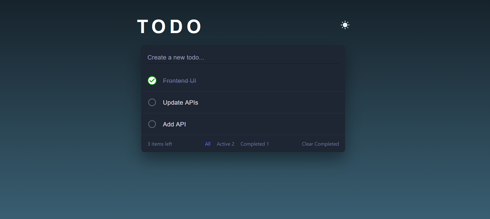

# TaskifyX

A full-stack Todo Application built using React, Node.js, Express,PostgreSQL, TanStack Query, and Material UI (MUI).  
This project demonstrates backend APIs, efficient frontend data fetching, and a clean, responsive UI.

## Features

- Create, update, delete todos
- Mark tasks as completed or pending
- Optimistic UI updates with TanStack Query
- RESTful API with Node.js & Express
- Persistent storage using PostgreSQL
- Responsive UI built with Material UI
- Proper loading and error handling

## 🛠️ Tech Stack

**Client:**  React, TanStack Query, Material UI (MUI), Axios, JavaScript (ES6+)

**Server:** Node.js, Express.js, PostgreSQL, REST API

## Screenshot 

